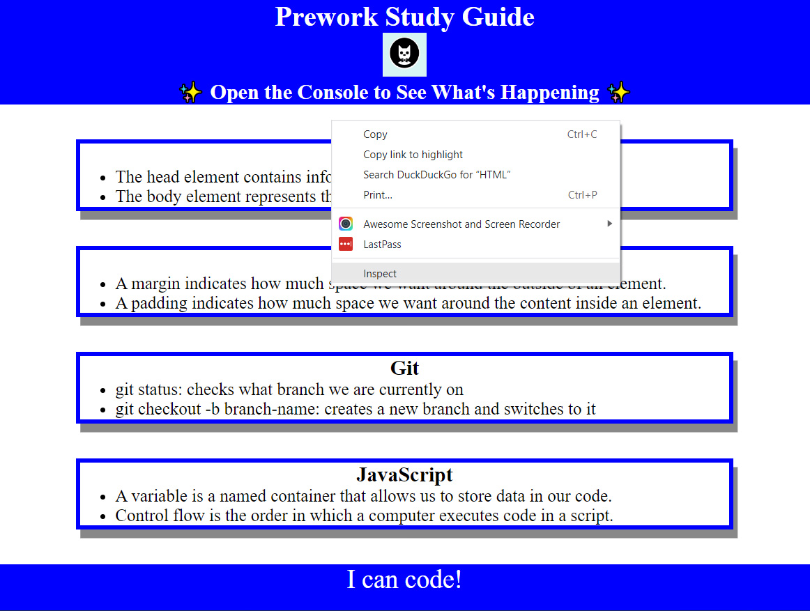
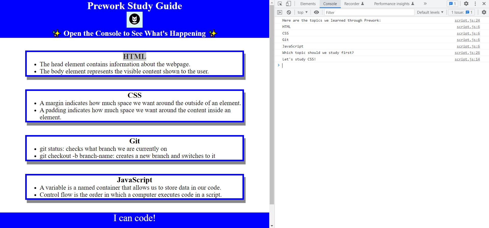

# Prework Study Guide

## Description

Provide a short description explaining the what, why, and how of your project. Use the following questions as a guide:

My motivation behind this project was to get used to using Git and GitHub. I have had very little interaction with version control and something as simple as a web guide made for good practice. 

The problem this project solves eliminating the need for physical notes. I learned and feel more comfortable with Git Bash, Visual Studio Code and understanding how these interfaces work together.

## Installation

What are the steps required to install your project? Provide a step-by-step description of how to get the development environment running.

## Usage

To use, open index.html in your favorite browser. If you're using Chrome, right click on the page and select "Inspect" to open the Developer Tool. Last, click on the "Console" tab and watch the magic.

Provide instructions and examples for use. Include screenshots as needed.

To add a screenshot, create an `assets/images` folder in your repository and upload your screenshot to it. Then, using the relative file path, add it to your README using the following syntax:

## Credits

N/A

## License

The last section of a high-quality README file is the license. This lets other developers know what they can and cannot do with your project. If you need help choosing a license, refer to [https://choosealicense.com/](https://choosealicense.com/).

---

🏆 The previous sections are the bare minimum, and your project will ultimately determine the content of this document. You might also want to consider adding the following sections.

## Badges

Badges aren't necessary, but they demonstrate street cred. Badges let other developers know that you know what you're doing. Check out the badges hosted by [shields.io](https://shields.io/). You may not understand what they all represent now, but you will in time.

## Features

If your project has a lot of features, list them here.

## How to Contribute

If you created an application or package and would like other developers to contribute to it, you can include guidelines for how to do so. The [Contributor Covenant](https://www.contributor-covenant.org/) is an industry standard, but you can always write your own if you'd prefer.

## Tests

Go the extra mile and write tests for your application. Then provide examples on how to run them here.